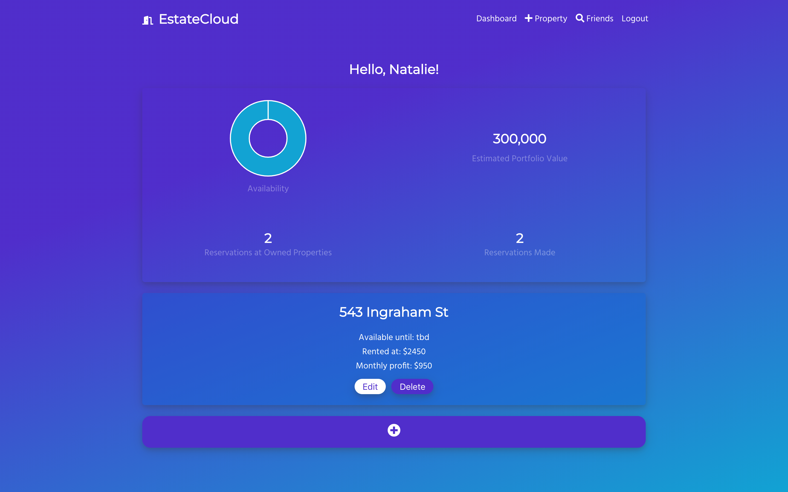
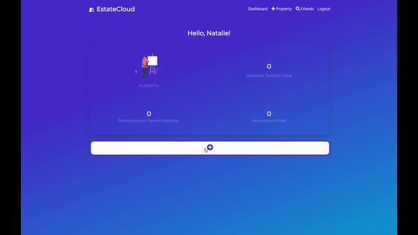
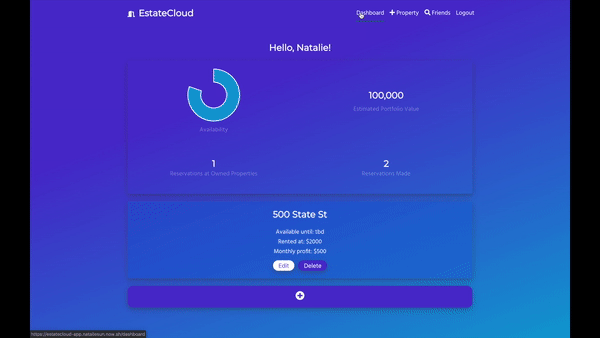

# EstateCloud App

> EstateCloud is an app to upload and manage your properties. It tracks monthly profit, estimated portfolio value and availability.

---
## Table of Contents
- [Main Features](#features)
- [Tech Used](#tech-used)
- [Server](#server)
- [Installation](#installation)
- [Documentation](#documentaion)
- [Tests](#tests)
- [Contributing](#contributing)
- [Team](#team)
- [FAQ](#faq)
- [Support](#support)
- [License](#license)

---
## Features

### Main Dashboard


### Add a Property


### Find Friends and Reserve


---

## Tech Used

> Client / Frontend
* React
* HTML
* CSS

> Server / Backend
* Node
* Express
* Postgresql
* Bcrypt

> Deployment
* Heroku
* Zeit / Now

---
## Server

https://github.com/nataliesun/estatecloud-api

## Installation
-Before set up server set up server: `git clone https://github.com/nataliesun/estatecloud-api.git`

-Clone the repo: `git clone https://github.com/nataliesun/estatecloud-app.git`

-Install dependencies: `npm install`

In the project directory, you can run:

### `npm start`

Runs the app in the development mode.<br>
Open [http://localhost:3000](http://localhost:3000) to view it in the browser.

The page will reload if you make edits.<br>
You will also see any lint errors in the console.

### `npm test`

Launches the test runner in the interactive watch mode.

---

## Documentation

A. Component Hierarchy
1. EstateCloud uses React and React Router Dom to handle routes and rendering
> Hierarchy is as follows
  ```
  App
  Routes
  Components
  ```

B. Security and Authentication
  1. EstateCloud uses JWT authentication and hashed passwords
  - passwords are not stored in database, only hash

C. Styling 
  1. EstateCloud uses Node Sass and CSS for styling

---

## Tests

- EstateCloud uses React's Jest tests for basic smoke and snapshot testing
- Each component folder contains a test for the component at  `"componentName".test.js`

---

## Contributing

> To get started...

### Step 1

- **Option 1**
    - 🍴 Fork this repo!

- **Option 2**
    - 👯 Clone this repo to your local machine using `https://github.com/nataliesun/estatecloud-app.git`

### Step 2

- **HACK AWAY!** 🔨🔨🔨

### Step 3

- 🔃 Create a new pull request using <a href="https://github.com/nataliesun/estatecloud-app/compare" target="_blank">`https://github.com/nataliesun/estatecloud-app/compare`</a>

---

## FAQ

- **How do I get more of EstateCloud and other goodies?**
    - No problem! Just shoot me an email, add me on LinkedIn or contribute to this project!

---

## Support

Reach out to me at one of the following places!

- Website at <a href="https://nataliesun.github.io/portfolio/" target="_blank">`https://nataliesun.github.io/portfolio/`</a>
- Twitter at <a href="http://twitter.com/fvcproductions" target="_blank">`@natalieesun`</a>
- LinkedIn:  <a href="https://www.linkedin.com/in/natalie-sun-159476142/" target="_blank">`Natalie Sun`</a>
- Email:  <a href="nataliemsun@gmail.com" target="_blank">`nataliemsun@gmail.com`</a>

---

## License

[](http://badges.mit-license.org)

- **[MIT license](http://opensource.org/licenses/mit-license.php)**
- Copyright 2019 © <a href="https://nataliesun.github.io/portfolio/" target="_blank">Natalie Sun</a>.